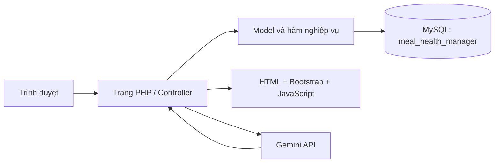
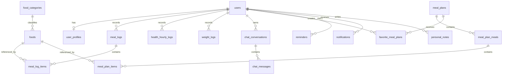

# Đặc tả yêu cầu phần mềm (SRS) – Hệ thống Quản lý Bữa ăn và Sức khỏe

## 1. Thông tin tài liệu

| Thuộc tính | Nội dung |
|---|---|
| Tên hệ thống | Meal & Health Manager – Quản lý Bữa ăn và Sức khỏe |
| Phiên bản ứng dụng | 1.0.0 |
| Loại tài liệu | Đặc tả yêu cầu phần mềm (Software Requirements Specification – SRS) |
| Ngày rà soát mã nguồn | 01/08/2026 |
| Nền tảng | PHP 8.x, MySQL 8.x, Apache/WAMP, HTML/CSS/JavaScript |
| Cơ sở dữ liệu | `meal_health_manager` |
| URL mặc định | `http://localhost/web_QuanLyBuaAn` |
| Trạng thái | Mô tả theo mã nguồn và cấu trúc CSDL hiện tại |

Tài liệu này có thể dùng làm nền cho báo cáo SRS, kiểm thử chức năng, thiết kế cơ sở dữ liệu và hướng dẫn triển khai. Những chỉ số sức khỏe trong hệ thống chỉ có ý nghĩa tham khảo, không thay thế chẩn đoán hoặc tư vấn y khoa.

## 2. Mục đích và phạm vi

### 2.1. Mục đích

Hệ thống hỗ trợ người dùng:

- Tạo tài khoản và sử dụng miễn phí, không cần đăng ký gói hoặc thanh toán.
- Khai báo hồ sơ thể chất, mục tiêu sức khỏe và chế độ ăn.
- Tính BMR, TDEE, lượng calories mục tiêu và các macro mục tiêu.
- Ghi nhật ký món ăn theo ngày, bữa và thời điểm tiêu thụ.
- Ghi nhận chỉ số sức khỏe theo từng giờ, theo dõi cân nặng và thói quen.
- Xem dashboard với dữ liệu theo 24 giờ và 7 ngày.
- Tra cứu món ăn, xem kế hoạch bữa ăn mẫu và đánh dấu yêu thích.
- Trao đổi với trợ lý AI về ăn uống, sức khỏe, dinh dưỡng và các câu hỏi phổ thông an toàn.
- Quản lý nhắc nhở, thông báo và nhật ký cá nhân.

Hệ thống hỗ trợ quản trị viên:

- Theo dõi số lượng người dùng, món ăn, thực đơn và nhật ký bữa ăn.
- Quản lý người dùng, danh mục món ăn, món ăn và thực đơn mẫu.
- Xem/xóa lịch sử chatbot và xử lý tin nhắn liên hệ.

### 2.2. Phạm vi đang hoạt động

- Website công khai, xác thực, khu vực người dùng và khu vực quản trị.
- Dữ liệu dinh dưỡng, bữa ăn, sức khỏe, cân nặng, chatbot, nhắc nhở và liên hệ.
- Tích hợp Gemini API; khi Gemini lỗi hoặc chưa cấu hình, hệ thống trả lời bằng bộ phản hồi nội bộ giới hạn.
- Tất cả tài khoản hợp lệ được sử dụng chức năng miễn phí.

### 2.3. Ngoài phạm vi hoặc đã vô hiệu hóa

- Không có quy trình thanh toán đang hoạt động.
- Trang `pricing.php` và `user/subscription.php` chỉ chuyển hướng về trang chính/dashboard.
- Các bảng `subscription_plans`, `user_subscriptions`, `transactions` và một số trang quản trị cũ vẫn còn để tương thích dữ liệu nhưng không thuộc luồng nghiệp vụ hiện hành.
- Quên mật khẩu hiện mô phỏng luồng đặt lại trong cùng phiên làm việc; chưa gửi email thật.
- Nhắc nhở được kích hoạt khi người dùng mở/tải một trang có header sau thời điểm nhắc; chưa có cron job, push notification hoặc tác vụ nền.
- Không đồng bộ tự động với thiết bị đeo, Google Fit, Apple Health hoặc thiết bị y tế.

## 3. Kiến trúc và công nghệ

### 3.1. Kiến trúc logic



### 3.2. Thành phần chính

| Thành phần | Vai trò |
|---|---|
| `config/` | Cấu hình URL, múi giờ, MySQL, Gemini và các tệp SQL |
| `auth/` | Đăng ký, đăng nhập, đăng xuất, quên/đặt lại mật khẩu |
| `user/` | Dashboard, hồ sơ, bữa ăn, cân nặng, chatbot, thực đơn, nhắc nhở, ghi chú |
| `admin/` | Dashboard và các màn hình quản trị |
| `api/chatbot/ask.php` | API JSON xử lý câu hỏi chatbot |
| `models/` | Truy cập dữ liệu hồ sơ, người dùng, món ăn, bữa ăn, cân nặng, sức khỏe |
| `includes/` | Header/footer, kiểm tra quyền, CSRF và hàm dùng chung |
| `assets/` | CSS và JavaScript giao diện |
| `uploads/foods/` | Ảnh món ăn do người dùng/quản trị viên tải lên |
| `img/logo_cty.png` | Logo đang sử dụng trên website |

### 3.3. Phụ thuộc phía giao diện

- Bootstrap 5.3.2 và Bootstrap Icons qua CDN.
- Chart.js để vẽ biểu đồ dashboard/cân nặng.
- AOS để tạo hiệu ứng giao diện.
- Trình duyệt cần có JavaScript và kết nối Internet để tải tài nguyên CDN và sử dụng Gemini.

## 4. Tác nhân và phân quyền

| Tác nhân | Quyền chính |
|---|---|
| Khách | Xem trang chủ, tính năng, thư viện/chi tiết món ăn, giới thiệu, liên hệ; đăng ký, đăng nhập, quên mật khẩu |
| Người dùng | Toàn bộ quyền khách; quản lý dữ liệu cá nhân, bữa ăn, sức khỏe, cân nặng, thực đơn yêu thích, chatbot, nhắc nhở, thông báo và ghi chú |
| Quản trị viên | Toàn bộ quyền người dùng; truy cập khu vực `/admin/` và quản lý dữ liệu hệ thống |
| Gemini API | Nhận prompt hệ thống, ngữ cảnh được phép và lịch sử gần nhất; trả nội dung tư vấn |

Quy tắc phân quyền:

- Trang trong `user/` dùng `auth-check.php`; người chưa đăng nhập bị chuyển đến đăng nhập.
- Trang trong `admin/` dùng `admin-check.php`; chỉ phiên có `user_role = admin` được truy cập.
- Các thao tác cập nhật/xóa dữ liệu cá nhân phải kèm `user_id` trong điều kiện SQL để ngăn sửa dữ liệu người khác.
- Hội thoại chatbot được kiểm tra quyền sở hữu trước khi tải, tiếp tục hoặc xóa.

## 5. Yêu cầu chức năng

### 5.1. Chức năng công khai

| Mã | Chức năng | Mô tả |
|---|---|---|
| FR-PUB-01 | Trang chủ | Giới thiệu hệ thống và điều hướng đến đăng ký/dashboard tùy trạng thái đăng nhập. |
| FR-PUB-02 | Trang tính năng | Trình bày các nhóm chức năng sức khỏe và dinh dưỡng. |
| FR-PUB-03 | Thư viện món ăn | Liệt kê món đang `active`, tìm theo tên, lọc danh mục và phân trang. |
| FR-PUB-04 | Chi tiết món ăn | Hiển thị ảnh, khẩu phần, calories, protein, carbs, fat, chất xơ, nguyên liệu và cách làm. |
| FR-PUB-05 | Ảnh dự phòng | Nếu đường dẫn ảnh sai/rỗng, dùng ảnh mặc định thay vì hiển thị ảnh vỡ. |
| FR-PUB-06 | Liên hệ | Nhận họ tên, email, chủ đề và nội dung; lưu trạng thái ban đầu `new`. |
| FR-PUB-07 | Miễn phí | Không hiển thị bảng giá trong điều hướng và không yêu cầu thanh toán để dùng chức năng. |

Ràng buộc liên hệ: họ tên tối đa 150 ký tự, chủ đề tối đa 200 ký tự, nội dung tối đa 5.000 ký tự và email phải đúng định dạng.

### 5.2. Đăng ký, đăng nhập và tài khoản

| Mã | Chức năng | Quy tắc |
|---|---|---|
| FR-AUTH-01 | Đăng ký | Yêu cầu họ tên, email, mật khẩu, xác nhận mật khẩu và đồng ý điều khoản. |
| FR-AUTH-02 | Kiểm tra đăng ký | Email hợp lệ/không trùng; mật khẩu tối thiểu 8 ký tự; hai mật khẩu phải giống nhau. |
| FR-AUTH-03 | Tạo tài khoản | Mật khẩu được băm bằng `password_hash`; tài khoản mặc định `role=user`, `status=active`. |
| FR-AUTH-04 | Đăng nhập | Kiểm tra email, `password_verify` và trạng thái tài khoản. |
| FR-AUTH-05 | Tạo phiên | Tái tạo session ID; lưu `user_id`, tên, họ tên và vai trò trong session. |
| FR-AUTH-06 | Điều hướng sau đăng nhập | Admin đến `/admin/index.php`; người dùng đến `/user/dashboard.php`. |
| FR-AUTH-07 | Ẩn/hiện mật khẩu | Trường mật khẩu đăng nhập, đăng ký và xác nhận mật khẩu có biểu tượng con mắt. |
| FR-AUTH-08 | Đăng xuất | Xóa dữ liệu session, cookie session và chuyển về trang chủ. |
| FR-AUTH-09 | Quên mật khẩu | Tạo token ngẫu nhiên, chỉ lưu SHA-256 của token, thời hạn 30 phút và vô hiệu token cũ. |
| FR-AUTH-10 | Đặt lại mật khẩu | Token phải còn hạn/chưa dùng; mật khẩu mới tối thiểu 8 ký tự; cập nhật trong transaction và đánh dấu token đã dùng. |

Lưu ý hiện trạng: token thô được giữ trong session và người dùng được chuyển trực tiếp đến trang đặt lại; chưa có dịch vụ gửi email.

### 5.3. Hồ sơ sức khỏe và mục tiêu

| Mã | Chức năng | Mô tả |
|---|---|---|
| FR-PRO-01 | Tạo/cập nhật hồ sơ | Lưu ngày sinh, giới tính, chiều cao, cân hiện tại, mức vận động, mục tiêu, tốc độ, chế độ ăn, dị ứng, món không thích và số bữa/ngày. Cột cân mục tiêu có trong CSDL nhưng biểu mẫu hiện tại chưa cho nhập. |
| FR-PRO-02 | Xác thực tuổi | Ngày sinh hợp lệ; tuổi trong khoảng 13–120. |
| FR-PRO-03 | Xác thực thể chất | Chiều cao 80–250 cm; cân nặng 20–400 kg. |
| FR-PRO-04 | Xác thực số bữa | Cho phép 1–6 bữa/ngày. |
| FR-PRO-05 | Tính mục tiêu | Tự động tính BMR, TDEE, calories và macro theo công thức tại mục 7. |
| FR-PRO-06 | Cá nhân hóa | Hồ sơ được dùng cho dashboard và prompt trợ lý AI. |

Giới tính dùng cho công thức hiện tại gồm `male` và `female`. Mức vận động gồm `sedentary`, `light`, `moderate`, `very_active`, `extra_active`. Mục tiêu gồm giảm cân, tăng cân, giữ cân và tăng cơ.

### 5.4. Nhật ký bữa ăn

| Mã | Chức năng | Mô tả |
|---|---|---|
| FR-MEAL-01 | Chọn ngày | Xem nhật ký theo tham số ngày `YYYY-MM-DD`; ngày sai được đưa về hôm nay. |
| FR-MEAL-02 | Sáu loại bữa | Sáng, phụ sáng, trưa, phụ chiều, tối và phụ tối. |
| FR-MEAL-03 | Thêm món có sẵn | Tìm tối đa 20 món, chọn số lượng và thêm vào bữa. |
| FR-MEAL-04 | Tạo món tùy chỉnh | Người dùng nhập khẩu phần, đơn vị, dinh dưỡng, nguyên liệu, cách làm và ảnh; món mới được thêm ngay vào nhật ký. |
| FR-MEAL-05 | Tính dinh dưỡng | Quy đổi calories và dưỡng chất theo tỷ lệ số lượng/khẩu phần gốc. |
| FR-MEAL-06 | Tổng theo bữa/ngày | Cộng calories, protein, carbs, fat, chất xơ từ tất cả item. |
| FR-MEAL-07 | Xóa món | Chỉ xóa item thuộc bữa của người dùng hiện tại. |
| FR-MEAL-08 | Xóa bữa | Xóa bữa đúng người dùng, ngày và loại bữa; item liên quan bị xóa theo quan hệ CSDL. |
| FR-MEAL-09 | Thời điểm tiêu thụ | Bữa hôm nay dùng thời gian hiện tại khi tạo; ngày khác dùng giờ mặc định theo loại bữa. |

Giờ mặc định: sáng 07:00, phụ sáng 10:00, trưa 12:00, phụ chiều 15:00, tối 19:00, phụ tối 21:00.

### 5.5. Dashboard sức khỏe

| Mã | Chức năng | Mô tả |
|---|---|---|
| FR-DASH-01 | Tổng quan hôm nay | Hiển thị calories đã nạp/mục tiêu, protein, nước, bước chân, BMI, vận động, giấc ngủ, nhịp tim và tâm trạng. |
| FR-DASH-02 | Ghi theo giờ | Lưu nước, bước chân, phút vận động, calories tiêu hao, nhịp tim, phút ngủ, tâm trạng và ghi chú theo ngày/giờ. |
| FR-DASH-03 | Một bản ghi/giờ | Khóa duy nhất `(user_id, log_date, log_hour)`; lưu lần nữa sẽ cập nhật bản ghi cũ. |
| FR-DASH-04 | Biểu đồ 24 giờ | So sánh calories nạp từ bữa ăn và calories vận động theo từng giờ. |
| FR-DASH-05 | Biểu đồ 7 ngày | Calories nạp so với mục tiêu; nước và bước chân; tiến độ macro. |
| FR-DASH-06 | Cân nặng | Vẽ tối đa 30 lần ghi cân gần nhất theo thứ tự thời gian. |
| FR-DASH-07 | Điểm thói quen | Tính trung bình sáu tiêu chí khi đã có ít nhất một giờ dữ liệu. |
| FR-DASH-08 | Dữ liệu trống | Hiển thị trạng thái “chưa có dữ liệu”, không tự coi 0 là dữ liệu sức khỏe thực. |
| FR-DASH-09 | Phân biệt dữ liệu mẫu | Ghi chú bắt đầu bằng “Dữ liệu mẫu” được đánh dấu để người dùng nhận biết. |

Giới hạn một bản ghi giờ:

- Ngày từ 30 ngày trước đến hôm nay; giờ từ 0 đến 23.
- Nước: 0–3.000 ml/giờ.
- Bước chân: 0–50.000 bước/giờ.
- Vận động: 0–60 phút/giờ.
- Calories tiêu hao: 0–2.000 kcal/giờ.
- Nhịp tim: để trống hoặc 30–250 bpm.
- Giấc ngủ: 0–60 phút/giờ.
- Tâm trạng: để trống hoặc 1–5.
- Ghi chú: tối đa 255 ký tự.

### 5.6. Theo dõi cân nặng

| Mã | Chức năng | Mô tả |
|---|---|---|
| FR-WGT-01 | Ghi cân | Lưu cân nặng, ngày và ghi chú. |
| FR-WGT-02 | Một bản ghi/ngày | Nếu ngày đã có dữ liệu thì cập nhật thay vì tạo trùng. |
| FR-WGT-03 | Tính BMI | Nếu hồ sơ có chiều cao, tính BMI tại thời điểm lưu. |
| FR-WGT-04 | Đồng bộ hồ sơ | Cập nhật `current_weight_kg` trong hồ sơ bằng cân vừa ghi. |
| FR-WGT-05 | Lịch sử/biểu đồ | Liệt kê lịch sử và vẽ đường biến động cân nặng. |
| FR-WGT-06 | Xóa | Chỉ xóa bản ghi thuộc người dùng hiện tại. |

### 5.7. Thực đơn gợi ý

| Mã | Chức năng | Mô tả |
|---|---|---|
| FR-PLAN-01 | Danh sách | Chỉ hiển thị thực đơn `active`, có thể lọc theo mục tiêu. |
| FR-PLAN-02 | Chi tiết | Hiển thị các bữa, từng món và tổng calories/protein/carbs/fat. |
| FR-PLAN-03 | Yêu thích | Thêm/bỏ yêu thích; một người dùng không thể yêu thích trùng một thực đơn. |
| FR-PLAN-04 | So sánh mục tiêu | Nếu có hồ sơ, hiển thị calories mục tiêu để người dùng chọn thực đơn phù hợp. |
| FR-PLAN-05 | Miễn phí | `is_premium` không được dùng để chặn truy cập trong luồng hiện tại. |

### 5.8. Trợ lý dinh dưỡng AI

| Mã | Chức năng | Mô tả |
|---|---|---|
| FR-AI-01 | Tạo hội thoại | Câu đầu tạo hội thoại mới; tiêu đề lấy tối đa 50 ký tự đầu của câu hỏi. |
| FR-AI-02 | Tiếp tục hội thoại | Tải và gửi tối đa 14 tin nhắn gần nhất theo đúng thứ tự vai trò. |
| FR-AI-03 | Cá nhân hóa | Gửi các trường hồ sơ được phép và tổng dinh dưỡng hôm nay vào system prompt. |
| FR-AI-04 | Phạm vi trả lời | Ưu tiên ăn uống, dinh dưỡng, vận động, phục hồi, ngủ, stress; vẫn trả lời ngắn gọn câu hỏi phổ thông ngoài luồng nếu an toàn. |
| FR-AI-05 | An toàn sức khỏe | Không chẩn đoán, kê đơn, khuyên ngừng thuốc hoặc cổ vũ hành vi giảm cân nguy hiểm. |
| FR-AI-06 | Gemini | Gửi yêu cầu `generateContent`, nhiệt độ 0,65, tối đa 1.200 output tokens, timeout kết nối 10 giây và toàn bộ 45 giây. |
| FR-AI-07 | Fallback | Nếu Gemini lỗi/không cấu hình, dùng câu trả lời nội bộ cho một số chủ đề cơ bản và thông báo nguồn `local`. |
| FR-AI-08 | Lưu lịch sử | Lưu cả tin người dùng và câu trả lời trợ lý vào CSDL. |
| FR-AI-09 | Quản lý lịch sử | Người dùng xem, mở lại và xóa hội thoại của mình. |
| FR-AI-10 | Giới hạn đầu vào | Câu hỏi bắt buộc, tối đa 1.000 ký tự và phải có CSRF hợp lệ. |

Dữ liệu hồ sơ có thể gửi cho Gemini khi có giá trị: tuổi, giới tính, chiều cao, cân hiện tại/đích, vận động, mục tiêu/tốc độ, chế độ ăn, dị ứng, món không thích, số bữa, calories và macro mục tiêu, chất xơ, nước. Không gửi mật khẩu, email hay API key.

### 5.9. Nhắc nhở và thông báo

| Mã | Chức năng | Mô tả |
|---|---|---|
| FR-REM-01 | CRUD nhắc nhở | Tạo, sửa, bật/tắt và xóa nhắc nhở thuộc người dùng. |
| FR-REM-02 | Loại nhắc | Ăn sáng/trưa/tối, ăn nhẹ, uống nước, cân nặng hoặc tùy chỉnh. |
| FR-REM-03 | Lặp | Một lần, hằng ngày, ngày trong tuần hoặc hằng tuần. |
| FR-REM-04 | Kích hoạt | Khi tải trang, nếu đã đến giờ và hôm nay chưa kích hoạt thì tạo thông báo. |
| FR-REM-05 | Một lần | Sau khi kích hoạt sẽ chuyển nhắc nhở sang `inactive`. |
| FR-NOT-01 | Chuông thông báo | Hiển thị số chưa đọc và 5 thông báo mới nhất. |
| FR-NOT-02 | Danh sách | Phân trang, đọc một thông báo, đánh dấu tất cả đã đọc và xóa thông báo. |

Nhắc hằng tuần dùng thứ trong tuần của `created_at`. Cơ chế hiện tại không chạy khi website không được truy cập.

### 5.10. Nhật ký cá nhân

| Mã | Chức năng | Mô tả |
|---|---|---|
| FR-NOTE-01 | Ghi nhật ký | Lưu ngày, nội dung, tâm trạng, mức đói và mức vận động. |
| FR-NOTE-02 | Cập nhật theo ngày | Nếu người dùng đã có ghi chú ngày đó, hệ thống cập nhật bản ghi. |
| FR-NOTE-03 | Tâm trạng | Rất tệ, tệ, bình thường, tốt, rất tốt. |
| FR-NOTE-04 | Vận động | Không tập, nhẹ, vừa hoặc cường độ cao. |
| FR-NOTE-05 | Xóa | Chỉ xóa ghi chú thuộc người dùng hiện tại. |

### 5.11. Quản trị hệ thống

| Mã | Chức năng | Mô tả |
|---|---|---|
| FR-ADM-01 | Dashboard admin | Đếm người dùng, món ăn, thực đơn hoạt động, nhật ký bữa ăn và liệt kê 5 người dùng mới. |
| FR-ADM-02 | Người dùng | Liệt kê, thêm, sửa, phân vai trò, đổi trạng thái, khóa/mở khóa và xóa. |
| FR-ADM-03 | Bảo vệ admin | Không cho thao tác khóa/xóa bằng nút nhanh đối với tài khoản admin; không cho tự xóa chính mình. |
| FR-ADM-04 | Danh mục món | Thêm/sửa/ẩn/xóa; khi xóa danh mục, các món bên trong được giữ lại và chuyển sang chưa phân loại. |
| FR-ADM-05 | Món ăn | Tìm kiếm, phân trang, thêm/sửa/xóa, gán danh mục, trạng thái và ảnh. Món đã có dữ liệu lịch sử được chuyển sang ẩn thay vì xóa vật lý. |
| FR-ADM-06 | Kiểm tra dinh dưỡng | Giá trị không âm; kiểm tra tổng macro theo khối lượng và calories ước tính. |
| FR-ADM-07 | Thực đơn | Thêm/sửa/xóa thực đơn; gán mục tiêu, chế độ ăn, ảnh và trạng thái. |
| FR-ADM-08 | Xây thực đơn | Tạo các bữa, thêm/xóa món và tự tính lại tổng dinh dưỡng toàn thực đơn. |
| FR-ADM-09 | Liên hệ | Xem chi tiết; chuyển `new`, `read`, `replied`; xóa tin nhắn. |
| FR-ADM-10 | Chatbot | Phân trang hội thoại, xem chi tiết qua API nội bộ và xóa hội thoại. |

Ảnh món ăn chấp nhận JPEG, PNG, WEBP, GIF; tối đa 5 MB; tên tệp được tạo từ thời gian và chuỗi ngẫu nhiên.

## 6. Luồng hoạt động chính

### 6.1. Luồng bắt đầu sử dụng

1. Khách mở trang chủ và chọn đăng ký.
2. Hệ thống kiểm tra CSRF, email, mật khẩu và điều khoản.
3. Hệ thống tạo tài khoản miễn phí và chuyển đến đăng nhập.
4. Người dùng đăng nhập; hệ thống tạo session và chuyển đến dashboard.
5. Nếu chưa có hồ sơ sức khỏe, dashboard yêu cầu cập nhật hồ sơ.
6. Người dùng nhập thông tin; hệ thống tính và lưu BMR, TDEE, calories và macro mục tiêu.
7. Dashboard dùng các mục tiêu này để so sánh với nhật ký thực tế.

### 6.2. Luồng ghi bữa ăn

1. Người dùng mở Nhật ký bữa ăn và chọn ngày.
2. Chọn một trong sáu loại bữa rồi bấm Thêm.
3. Tìm/chọn món có sẵn hoặc tạo món tùy chỉnh.
4. Nhập số lượng; hệ thống kiểm tra giá trị dương.
5. Hệ thống tạo `meal_logs` nếu bữa chưa tồn tại.
6. Hệ thống tính dinh dưỡng theo tỷ lệ và lưu `meal_log_items`.
7. Tổng theo bữa/ngày và biểu đồ dashboard được tính lại từ dữ liệu lưu.

### 6.3. Luồng ghi sức khỏe theo giờ

1. Người dùng mở dashboard và nhập ngày, giờ cùng các chỉ số.
2. Hệ thống kiểm tra phạm vi từng trường và CSRF.
3. Nếu `(user, ngày, giờ)` chưa tồn tại thì thêm mới; nếu đã tồn tại thì cập nhật.
4. Hệ thống cộng dữ liệu ngày, tính trung bình nhịp tim/tâm trạng và dựng chuỗi 24 giờ.
5. Dashboard cập nhật thẻ chỉ số, điểm thói quen và các biểu đồ.

### 6.4. Luồng chatbot

1. Người dùng nhập câu hỏi trong `user/chatbot.php`.
2. JavaScript gửi JSON đến `api/chatbot/ask.php` kèm `conversation_id` và CSRF.
3. API xác thực session, dữ liệu đầu vào và quyền sở hữu hội thoại.
4. API lưu câu hỏi, lấy hồ sơ, dinh dưỡng hôm nay và tối đa 14 tin nhắn gần nhất.
5. Nếu có API key, hệ thống gọi Gemini; nếu lỗi thì chuyển sang phản hồi nội bộ.
6. Hệ thống lưu câu trả lời, trả JSON và giao diện hiển thị nội dung.

### 6.5. Luồng nhắc nhở

1. Người dùng tạo nhắc nhở và chọn thời gian/lặp lại.
2. Khi người dùng tải một trang có header, hệ thống duyệt nhắc nhở đang hoạt động chưa kích hoạt hôm nay.
3. Nếu đã đến giờ và đúng quy tắc lặp, hệ thống tạo một bản ghi `notifications`.
4. Hệ thống cập nhật `last_triggered_date`; nhắc một lần sẽ bị tắt.
5. Chuông thông báo hiển thị số chưa đọc.

### 6.6. Luồng quản trị thực đơn mẫu

1. Admin tạo thông tin chung của thực đơn.
2. Admin mở trình xây dựng và tạo các bữa.
3. Admin chọn món cùng khối lượng gram cho từng bữa.
4. Hệ thống tính calories/macro của item rồi cộng lại vào tổng thực đơn.
5. Khi xóa món hoặc bữa, tổng dinh dưỡng được tính lại.
6. Thực đơn `active` xuất hiện cho người dùng và có thể được yêu thích.

## 7. Công thức và quy tắc tính toán

### 7.1. Tuổi

Tuổi `A` được tính bằng chênh lệch năm đầy đủ giữa ngày hiện tại và ngày sinh, có xét ngày/tháng sinh. Chỉ chấp nhận `13 ≤ A ≤ 120`.

### 7.2. BMR – Mifflin–St Jeor

Ký hiệu:

- `W`: cân nặng hiện tại, đơn vị kg.
- `H`: chiều cao, đơn vị cm.
- `A`: tuổi, đơn vị năm.

Nam:

```text
BMR = 10 × W + 6.25 × H − 5 × A + 5
```

Nữ:

```text
BMR = 10 × W + 6.25 × H − 5 × A − 161
```

Đơn vị BMR là kcal/ngày.

### 7.3. TDEE

```text
TDEE = BMR × hệ_số_vận_động
```

| Mức vận động | Giá trị | Hệ số |
|---|---|---:|
| Ít vận động | `sedentary` | 1,2 |
| Nhẹ, khoảng 1–3 buổi/tuần | `light` | 1,375 |
| Vừa, khoảng 3–5 buổi/tuần | `moderate` | 1,55 |
| Nhiều, khoảng 6–7 buổi/tuần | `very_active` | 1,725 |
| Rất nhiều/lao động nặng | `extra_active` | 1,9 |

### 7.4. Calories theo mục tiêu

```text
Calories mục tiêu = TDEE + mức điều chỉnh
```

| Mục tiêu | Tốc độ | Điều chỉnh |
|---|---|---:|
| Giữ cân | Mặc định | 0 kcal |
| Giảm cân | Chậm | −250 kcal |
| Giảm cân | Vừa | −500 kcal |
| Giảm cân | Nhanh | −750 kcal |
| Tăng cân | Chậm | +300 kcal |
| Tăng cân | Vừa | +500 kcal |
| Tăng cơ | Chậm | +300 kcal |
| Tăng cơ | Vừa | +500 kcal |

Tốc độ `fast` không hợp lệ cho tăng cân/tăng cơ. Mục tiêu giữ cân tự dùng tốc độ `moderate` nhưng mức điều chỉnh vẫn bằng 0.

### 7.5. Mục tiêu macro

Phân bổ hiện tại: 30% protein, 40% carbohydrate, 30% chất béo.

```text
Protein (g) = Calories mục tiêu × 0,30 ÷ 4
Carbs (g)   = Calories mục tiêu × 0,40 ÷ 4
Fat (g)     = Calories mục tiêu × 0,30 ÷ 9
```

Kết quả được làm tròn 2 chữ số thập phân. Chất xơ và nước là chỉ tiêu hồ sơ riêng; mặc định ứng dụng dùng khoảng 25 g chất xơ và 2.000 ml nước nếu chưa có dữ liệu phù hợp.

### 7.6. BMI

```text
BMI = W ÷ (H / 100)²
```

Nhãn tham khảo trên dashboard:

- `< 18,5`: Dưới ngưỡng tham khảo.
- `18,5 đến < 25`: Trong ngưỡng tham khảo.
- `25 đến < 30`: Trên ngưỡng tham khảo.
- `≥ 30`: Cao hơn ngưỡng tham khảo.

Nếu chưa có chiều cao hợp lệ thì không tính BMI. Dashboard ưu tiên cân mới nhất trong `weight_logs`, nếu không có thì dùng cân hiện tại trong hồ sơ.

### 7.7. Dinh dưỡng của món trong nhật ký

Với `Q` là số lượng người dùng nhập và `S` là khẩu phần gốc của món:

```text
Tỷ lệ = Q ÷ S
Calories item = Calories khẩu phần gốc × Tỷ lệ
Protein item  = Protein khẩu phần gốc × Tỷ lệ
Carbs item    = Carbs khẩu phần gốc × Tỷ lệ
Fat item      = Fat khẩu phần gốc × Tỷ lệ
Fiber item    = Fiber khẩu phần gốc × Tỷ lệ
```

Mỗi kết quả làm tròn 2 chữ số. `calculated_grams = Q` khi đơn vị là `g`, `gram` hoặc `grams`; với đơn vị khác, trường này hiện lưu 0.

### 7.8. Kiểm tra dữ liệu dinh dưỡng món tùy chỉnh

Nếu đơn vị là gram:

```text
Protein + Carbs + Fat + Fiber ≤ Serving size + 0,01
```

Calories ước tính theo macro:

```text
Calories ước tính = Protein × 4 + Carbs × 4 + Fat × 9
Sai lệch cho phép = max(20 kcal, Calories ước tính × 20%)
```

Nếu calories nhập lệch quá sai số trên, hệ thống từ chối lưu.

### 7.9. Tổng dinh dưỡng ngày

```text
Tổng ngày của từng chỉ số = tổng chỉ số của mọi meal_log_item
                             thuộc user và log_date đang chọn
```

Tổng theo giờ dùng giờ của `meal_logs.consumed_at`; dữ liệu cũ chưa có giờ sẽ được ánh xạ theo giờ mặc định của loại bữa.

### 7.10. Tổng sức khỏe ngày

- Nước, bước chân, phút vận động, calories tiêu hao và phút ngủ: cộng tất cả giờ trong ngày.
- Nhịp tim: trung bình các bản ghi có nhịp tim lớn hơn 0.
- Tâm trạng: trung bình các bản ghi có giá trị lớn hơn 0.
- Số giờ đã ghi: số dòng sức khỏe của ngày đó.

Mục tiêu mặc định của dashboard: 8.000 bước/ngày, 30 phút vận động/ngày và 420 phút ngủ/ngày. Nước và macro lấy từ hồ sơ.

### 7.11. Điểm thói quen

Chỉ tính khi có ít nhất một giờ dữ liệu sức khỏe:

```text
Điểm calories = max(0, 100 − |calories đã nạp − calories mục tiêu|
                           ÷ calories mục tiêu × 100)

Điểm protein  = min(100, protein thực tế ÷ protein mục tiêu × 100)
Điểm nước     = min(100, nước thực tế ÷ nước mục tiêu × 100)
Điểm bước     = min(100, bước thực tế ÷ 8.000 × 100)
Điểm vận động = min(100, phút vận động ÷ 30 × 100)
Điểm giấc ngủ = min(100, phút ngủ ÷ 420 × 100)

Điểm thói quen = trung bình cộng của 6 điểm trên
```

Phân loại:

- `≥ 85`: Rất tốt.
- `≥ 70`: Ổn định.
- `≥ 50`: Cần cải thiện.
- `< 50`: Cần bổ sung thói quen.

### 7.12. Tính thực đơn mẫu

Trong trình xây dựng admin, dữ liệu được hiểu là dưỡng chất trên 100 g:

```text
Tỷ lệ = khối lượng gram ÷ 100
Chỉ số item = chỉ số món × tỷ lệ
Tổng thực đơn = tổng mọi item trong mọi bữa của thực đơn
```

Điểm cần thống nhất dữ liệu: nhật ký người dùng tính theo `serving_size`, còn trình xây thực đơn admin hiện tính theo 100 g. Vì vậy món dùng trong thực đơn mẫu nên được chuẩn hóa chỉ số trên 100 g; nếu không, cần sửa trình xây dựng để dùng `quantity / serving_size`.

## 8. Mô hình dữ liệu

### 8.1. Quan hệ chính



### 8.2. Từ điển bảng dữ liệu

| Bảng | Mục đích | Khóa/ràng buộc quan trọng |
|---|---|---|
| `users` | Tài khoản, vai trò, trạng thái | PK `id`; email unique |
| `user_profiles` | Hồ sơ và mục tiêu dinh dưỡng | Unique `user_id`; xóa cascade theo user |
| `food_categories` | Danh mục món ăn | Slug unique |
| `foods` | Món ăn và dưỡng chất theo khẩu phần | Slug unique; category/creator có thể null |
| `meal_logs` | Một bữa của user theo ngày/loại | Unique `(user_id, log_date, meal_type)` |
| `meal_log_items` | Các món trong bữa và dưỡng chất đã quy đổi | FK đến meal log; xóa cascade theo meal log |
| `health_hourly_logs` | Chỉ số sức khỏe theo từng giờ | Unique `(user_id, log_date, log_hour)` |
| `weight_logs` | Lịch sử cân nặng và BMI | Unique `(user_id, log_date)` |
| `meal_plans` | Thông tin/tổng dinh dưỡng thực đơn mẫu | Slug unique |
| `meal_plan_meals` | Các bữa thuộc thực đơn | FK đến meal plan |
| `meal_plan_items` | Món thuộc từng bữa mẫu | FK đến meal và food |
| `favorite_meal_plans` | Quan hệ yêu thích | Unique `(user_id, meal_plan_id)` |
| `chat_conversations` | Phiên hội thoại AI | FK user, xóa cascade |
| `chat_messages` | Nội dung từng tin nhắn | Sender: user/assistant/system |
| `chatbot_usage_logs` | Số lượt/token theo ngày | Unique `(user_id, usage_date)`; hiện chưa dùng để chặn miễn phí |
| `reminders` | Cấu hình nhắc nhở | Thời gian, kiểu lặp, trạng thái, ngày kích hoạt cuối |
| `notifications` | Thông báo của người dùng | Cờ `is_read`, loại info/success/warning/danger |
| `personal_notes` | Ghi chú, tâm trạng, đói và vận động | FK user; tra cứu theo user/ngày |
| `contact_messages` | Tin nhắn liên hệ | Trạng thái new/read/replied |
| `password_resets` | Token đặt lại mật khẩu | Token hash unique, hạn dùng, thời điểm đã dùng |
| `subscription_plans` | Gói dịch vụ cũ | Legacy, không thuộc luồng đang hoạt động |
| `user_subscriptions` | Đăng ký gói cũ | Legacy, không thuộc luồng đang hoạt động |
| `transactions` | Giao dịch cũ | Legacy, không thuộc luồng đang hoạt động |

Quan hệ xóa chính:

- Xóa user sẽ cascade hồ sơ, bữa ăn, sức khỏe, cân nặng, chatbot, nhắc nhở, thông báo, ghi chú và yêu thích.
- Xóa cuộc hội thoại sẽ cascade tin nhắn.
- Xóa bữa sẽ cascade item.
- Food đang được tham chiếu bởi item bữa ăn/thực đơn được giao diện admin chuyển sang `inactive` để bảo toàn lịch sử; food chưa được tham chiếu được xóa vật lý.

## 9. Giao diện và API

### 9.1. Các URL chính

| Nhóm | URL |
|---|---|
| Công khai | `/`, `/features.php`, `/foods.php`, `/food-detail.php`, `/about.php`, `/contact.php` |
| Xác thực | `/auth/register.php`, `/auth/login.php`, `/auth/logout.php`, `/auth/forgot-password.php`, `/auth/reset-password.php` |
| Người dùng | `/user/dashboard.php`, `/user/profile.php`, `/user/meals.php`, `/user/add-meal.php` |
| Sức khỏe | `/user/weight-logs.php`, `/user/personal-notes.php`, `/user/reminders.php`, `/user/notifications.php` |
| Thực đơn | `/user/meal-plans.php`, `/user/meal-plan-view.php` |
| Chatbot | `/user/chatbot.php`, `/user/chat-history.php`, `/api/chatbot/ask.php` |
| Admin | `/admin/index.php`, `/admin/users.php`, `/admin/foods.php`, `/admin/food-categories.php`, `/admin/meal-plans.php`, `/admin/contact-messages.php`, `/admin/chat-logs.php` |

### 9.2. API hỏi chatbot

`POST /api/chatbot/ask.php`

Request JSON:

```json
{
  "question": "Hôm nay tôi còn bao nhiêu calories?",
  "conversation_id": 12,
  "csrf_token": "session-csrf-token"
}
```

`conversation_id` có thể bỏ trống/0 để tạo hội thoại mới.

Response thành công:

```json
{
  "status": "success",
  "answer": "Nội dung HTML an toàn để hiển thị",
  "conversation_id": 12,
  "source": "gemini",
  "notice": null
}
```

Mã lỗi chính: `400` JSON sai, `401` chưa đăng nhập, `419` CSRF hết hạn, `422` câu hỏi rỗng/quá dài.

## 10. Yêu cầu bảo mật và riêng tư

| Mã | Yêu cầu |
|---|---|
| SEC-01 | Mọi form thay đổi dữ liệu phải kiểm tra CSRF. |
| SEC-02 | Mật khẩu chỉ lưu dạng băm; không ghi log mật khẩu. |
| SEC-03 | Tái tạo session ID sau đăng nhập và xóa session/cookie khi đăng xuất. |
| SEC-04 | Dùng PDO prepared statements cho dữ liệu đầu vào. |
| SEC-05 | Escape HTML khi hiển thị dữ liệu do người dùng nhập. |
| SEC-06 | Mọi cập nhật/xóa dữ liệu cá nhân phải kiểm tra `user_id`. |
| SEC-07 | Upload ảnh kiểm tra kích thước, MIME và tạo tên ngẫu nhiên. |
| SEC-08 | Gemini API key không được đưa ra giao diện, log công khai hoặc tài liệu. |
| SEC-09 | Nên chuyển API key và mật khẩu CSDL sang biến môi trường khi triển khai thật. |
| SEC-10 | Nên tắt `display_errors` ở production và ghi lỗi vào file log ngoài thư mục public. |

Lưu ý triển khai: nếu API key từng được lưu trực tiếp trong mã nguồn hoặc chia sẻ công khai, cần thu hồi/đổi key và dùng secret ngoài repository.

## 11. Yêu cầu phi chức năng

| Mã | Nhóm | Yêu cầu đề xuất cho nghiệm thu |
|---|---|---|
| NFR-01 | Hiệu năng | Trang thông thường phản hồi dưới 2 giây trong mạng nội bộ với dữ liệu thử nghiệm; Gemini phụ thuộc dịch vụ ngoài. |
| NFR-02 | Khả dụng | Giao diện responsive cho desktop/mobile; ảnh lỗi phải có fallback. |
| NFR-03 | Tin cậy | Các thao tác nhiều bước quan trọng như đặt lại mật khẩu/tạo món tùy chỉnh phải dùng transaction. |
| NFR-04 | Toàn vẹn | Dùng khóa ngoại, unique key và validation phía server; không chỉ dựa vào HTML/JavaScript. |
| NFR-05 | Bảo trì | URL, CSDL và Gemini đặt trong `config/`; truy cập dữ liệu chính đặt trong `models/`. |
| NFR-06 | Tương thích | PHP 8.x, MySQL 8.x/MariaDB tương thích CHECK, Apache mod_php và trình duyệt hiện đại. |
| NFR-07 | Mã hóa | Production phải dùng HTTPS; cookie session nên bật `Secure`, `HttpOnly`, `SameSite`. |
| NFR-08 | Sao lưu | Cần sao lưu CSDL và thư mục `uploads/foods/` định kỳ. |
| NFR-09 | Khả năng tiếp cận | Trường form cần label, nút icon cần title/aria-label và màu không phải tín hiệu duy nhất. |
| NFR-10 | Y tế | Mọi kết quả BMI, calories, điểm thói quen và tư vấn AI phải ghi rõ mang tính tham khảo. |

## 12. Cài đặt và chạy hệ thống

### 12.1. Yêu cầu môi trường

- Windows với WAMP64 hoặc môi trường tương đương Apache + PHP + MySQL.
- PHP 8.x; bật các extension: `pdo_mysql`, `mbstring`, `curl`, `fileinfo`, `openssl`, `iconv`.
- MySQL 8.x; cổng mặc định 3306.
- Apache cổng 80 hoặc cập nhật lại `BASE_URL` nếu dùng cổng khác.

### 12.2. Cài đặt mới

1. Đặt mã nguồn tại:

   ```text
   C:\wamp64\www\web_QuanLyBuaAn
   ```

2. Khởi động Apache và MySQL trong WAMP; biểu tượng WAMP cần ở trạng thái xanh.
3. Mở phpMyAdmin tại `http://localhost/phpmyadmin`.
4. Import `config/meal_health_manager.sql`. Tệp tự tạo và chọn CSDL `meal_health_manager`, đồng thời tạo cấu trúc cùng dữ liệu mẫu.
5. Kiểm tra `config/database.php`:

   ```text
   host     = 127.0.0.1
   database = meal_health_manager
   username = root
   password = rỗng (mặc định WAMP)
   ```

6. Kiểm tra `config/app.php`; nếu thư mục/cổng khác thì sửa `BASE_URL`.
7. Cấu hình Gemini trong `config/gemini.php` bằng API key hợp lệ. Không commit key thật lên Git.
8. Đảm bảo Apache có quyền ghi vào `uploads/foods/`.
9. Mở `http://localhost/web_QuanLyBuaAn` và đăng ký tài khoản mới để kiểm thử.

### 12.3. Nâng cấp CSDL hiện có

Nếu CSDL cũ chưa có dashboard theo giờ:

1. Sao lưu CSDL.
2. Chọn CSDL `meal_health_manager` trong phpMyAdmin.
3. Import `config/dashboard_health_upgrade.sql` để tạo `health_hourly_logs` và thêm `meal_logs.consumed_at` nếu thiếu.
4. Không cần import dữ liệu mẫu để hệ thống hoạt động.
5. Chỉ khi muốn xem dashboard demo, import `config/dashboard_health_sample_data.sql`. Tệp này thêm dữ liệu ngày hiện tại cho mọi user đang hoạt động và dùng `INSERT IGNORE` để không ghi đè giờ đã có.

### 12.4. Tạo tài khoản quản trị an toàn

1. Đăng ký một tài khoản bình thường qua website.
2. Trong phpMyAdmin, đổi `role` của đúng tài khoản đó từ `user` thành `admin`.
3. Đăng xuất rồi đăng nhập lại để session nhận vai trò mới.
4. Không đặt mật khẩu dạng rõ trực tiếp vào cột `users.password`; cột này phải chứa hash do PHP tạo.

### 12.5. Kiểm tra sau cài đặt

- Đăng ký và đăng nhập thành công.
- Cập nhật hồ sơ và thấy BMR/TDEE/mục tiêu.
- Thêm một món vào nhật ký và thấy dashboard cập nhật calories.
- Ghi một giờ sức khỏe và thấy biểu đồ/thẻ chỉ số cập nhật.
- Gửi câu hỏi chatbot; nếu Gemini lỗi phải thấy thông báo fallback thay vì lỗi trắng.
- Đăng nhập admin và mở các trang quản trị.
- Tải ảnh món ăn và kiểm tra URL ảnh không bị vỡ.

## 13. Tiêu chí nghiệm thu mẫu

| Mã | Kịch bản | Kết quả mong đợi |
|---|---|---|
| AC-01 | Đăng ký email mới, mật khẩu ≥ 8 ký tự | Tạo tài khoản `user/active`, không yêu cầu thanh toán |
| AC-02 | Đăng ký email đã tồn tại | Báo lỗi, không tạo bản ghi trùng |
| AC-03 | Đăng nhập tài khoản bị khóa | Từ chối đăng nhập |
| AC-04 | Lưu hồ sơ nam 30 tuổi, 70 kg, 175 cm, moderate | BMR/TDEE tính đúng công thức và lưu mục tiêu |
| AC-05 | Chọn giảm cân vừa | Calories mục tiêu bằng TDEE − 500 |
| AC-06 | Thêm 150 g món có khẩu phần 100 g | Mọi chỉ số item bằng 1,5 lần chỉ số gốc |
| AC-07 | Nhập calories món lệch quá 20% macro | Hệ thống từ chối và báo calories ước tính |
| AC-08 | Ghi hai lần cùng ngày/giờ | Chỉ có một dòng; lần sau cập nhật dòng cũ |
| AC-09 | Ghi cân cùng ngày hai lần | Chỉ có một dòng cho ngày và hồ sơ nhận cân mới |
| AC-10 | User A mở/xóa hội thoại User B | Bị từ chối hoặc không tìm thấy dữ liệu |
| AC-11 | Gemini không kết nối | API vẫn trả `status=success`, `source=local` và notice phù hợp |
| AC-12 | Nhắc một lần đã đến giờ, tải trang | Tạo một thông báo, cập nhật ngày kích hoạt và tắt nhắc |
| AC-13 | Xóa danh mục còn món | Xóa danh mục thành công; món được giữ lại với `category_id = NULL` |
| AC-14 | User thường truy cập `/admin/` | Bị chặn/chuyển hướng |
| AC-15 | Ảnh món rỗng hoặc sai | Hiển thị ảnh dự phòng, không hiện biểu tượng ảnh vỡ |

## 14. Giới hạn hiện tại và đề xuất phát triển

Các mục sau nên được ghi là yêu cầu tương lai, không mô tả như chức năng đã hoàn thành:

1. Gửi email đặt lại mật khẩu qua SMTP và không phụ thuộc session hiện tại.
2. Tách secret sang `.env`, bổ sung giới hạn tần suất đăng nhập/chatbot và audit log admin.
3. Dùng cron/queue/service worker cho nhắc nhở thật ngay cả khi người dùng không mở trang.
4. Cho phép sửa thời điểm tiêu thụ của từng bữa để biểu đồ 24 giờ chính xác hơn.
5. Chuẩn hóa công thức thực đơn admin theo `serving_size` thay vì giả định mọi món là trên 100 g.
6. Bổ sung chất đường, natri và vi chất vào dashboard nếu dữ liệu món ăn được nhập đầy đủ.
7. Thêm xuất báo cáo PDF/Excel, lọc khoảng ngày và so sánh xu hướng dài hạn.
8. Thêm kiểm thử tự động, migration có phiên bản và quy trình triển khai production.
9. Thêm cơ chế đồng ý/chính sách riêng tư khi gửi dữ liệu hồ sơ sang AI bên thứ ba.
10. Bổ sung cảnh báo y tế theo quy tắc rõ ràng nhưng không tự chẩn đoán.

## 15. Truy vết mã nguồn

| Nghiệp vụ | Tệp chính |
|---|---|
| Cấu hình | `config/app.php`, `config/database.php`, `config/gemini.php` |
| Xác thực | `auth/*.php`, `models/UserModel.php`, `includes/auth-check.php` |
| Hồ sơ/công thức | `user/profile.php`, `models/ProfileModel.php` |
| Bữa ăn | `user/meals.php`, `user/add-meal.php`, `models/MealModel.php` |
| Dashboard theo giờ | `user/dashboard.php`, `models/HealthMetricModel.php`, `models/WeightModel.php` |
| Món ăn công khai | `foods.php`, `food-detail.php`, `models/FoodModel.php` |
| Chatbot | `user/chatbot.php`, `user/chat-history.php`, `api/chatbot/ask.php` |
| Thực đơn mẫu | `user/meal-plans.php`, `user/meal-plan-view.php`, `admin/meal-plan-*.php` |
| Nhắc nhở/thông báo | `user/reminders.php`, `user/notifications.php`, `includes/header.php` |
| Admin | `admin/*.php`, `includes/admin-check.php` |
| CSDL | `config/meal_health_manager.sql`, `config/dashboard_health_upgrade.sql`, `config/dashboard_health_sample_data.sql` |

---

Tài liệu phản ánh cách hệ thống hiện đang hoạt động. Khi thay đổi công thức, cấu trúc bảng, API hoặc quyền truy cập, cần cập nhật đồng thời các mục yêu cầu chức năng, mô hình dữ liệu, tiêu chí nghiệm thu và truy vết mã nguồn.
